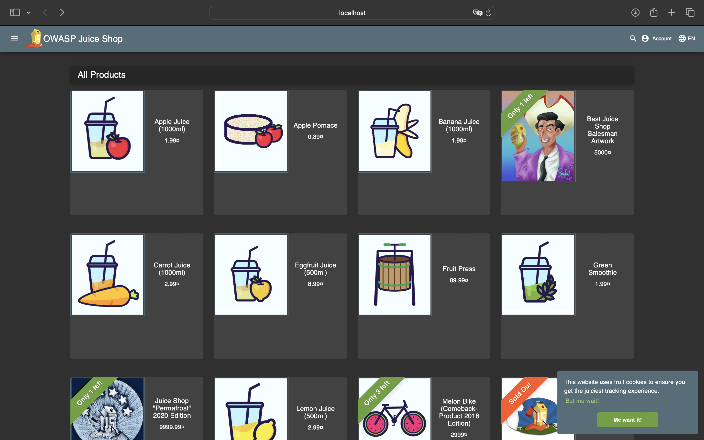

* image: `bkimminich/juice-shop:v19.0.0`
* release_date: `2025-09-04`
* release_notes: `https://github.com/juice-shop/juice-shop/releases/tag/v19.0.0`

# Triage Report — OWASP Juice Shop

## Scope & Asset
- Asset: OWASP Juice Shop (local lab instance)
- Image: bkimminich/juice-shop:v19.0.0
- Release link/date: https://github.com/juice-shop/juice-shop/releases/tag/v19.0.0 — 2025-09-04
- Image digest (optional): <sha256:...>

## Environment
- Host OS: macOS 14.2
- Docker: 28.0.1

## Deployment Details
- Run command used: `docker run -d --name juice-shop -p 127.0.0.1:3000:3000 bkimminich/juice-shop:v19.0.0`
- Access URL: http://127.0.0.1:3000
- Network exposure: 127.0.0.1 only [x] Yes  [ ] No  (explain if No)

## Health Check

```
$ curl -s http://127.0.0.1:3000/rest/products | head
<!-- <html>
  <head>
    <meta charset='utf-8'> 
    <title>Error: Unexpected path: /rest/products</title>
    <style>* {
  margin: 0;
  padding: 0;
  outline: 0; -->
```

## Surface Snapshot (Triage)
- Login/Registration visible: [x] Yes  [ ] No — I can register and log in to the service, but there are no checks like confirmation of email. There is password advice that help to make secure password
- Product listing/search present: [x] Yes  [ ] No — Product search works good: upper-case and lower-case letters are taken into account here. Also I want to single out that I can view the admin's review of the product and can write my own
- Admin or account area discoverable: [x] Yes  [ ] No
- Client-side errors in console: [ ] Yes  [x] No

## Risks Observed (Top 3)
1) **SQL Injection (SQLi) in Login** — The login form accepts raw user input, and inserting `\"` or `'` causes syntax errors, indicating it is vulnerable to SQL Injection that could allow bypassing authentication (e.g., logging in as administrator).  

2) **Cross-Site Scripting (XSS) in Search** — The product search field reflects unsanitized user input back into the page, allowing injection of HTML/JavaScript (e.g., `<h1>owasp`), which attackers can abuse to run malicious scripts in users’ browsers.  

3) **Unprotected Sensitive Functionality (Score Board)** — Sensitive developer/admin functionality like the Score Board is accessible through hidden endpoints and can be discovered by URL guessing or inspecting client-side JavaScript, exposing internal features that should be access-controlled.  
