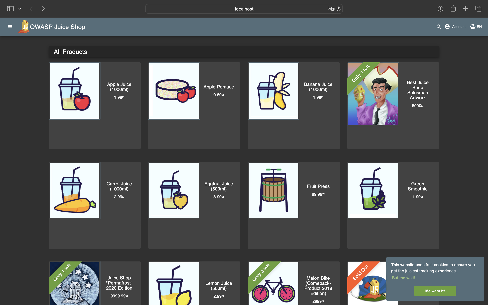

# Lab 10 - Vulnerability Management & Response with DefectDojo

## 1. DefectDojo Local Setup

### 1.1 Environment Setup Summary

* DefectDojo cloned from upstream repo.
* Docker Compose build completed successfully.
* All containers running and healthy (`docker compose ps`).
* Admin credentials retrieved from initializer logs.

### 1.2 Evidence




---

## 2. Importing Findings (ZAP, Semgrep, Trivy, Nuclei, Grype)

### 2.1 API Setup

* API token obtained
* Environment variables set:

  ```bash
  export DD_API="http://localhost:8080/api/v2"
  export DD_TOKEN="<token>"
  export DD_PRODUCT_TYPE="Engineering"
  export DD_PRODUCT="Juice Shop"
  export DD_ENGAGEMENT="Labs Security Testing"
  ```

### 2.2 Imported Reports

* ZAP —
* Semgrep 
* Trivy 
* Nuclei 
* Grype 

### 2.3 Import Evidence

* JSON responses stored under `labs/lab10/imports/`
* Notes on number of findings produced per tool

---

## 3. Reporting & Metrics

### 3.1 Metrics Snapshot

* **Date captured:** Dec 1, 2025
* **Active findings:**

  * Critical: 8
  * High: 21
  * Medium: 23
  * Low: 1
  * Informational: 15
* **Verified vs. Mitigated Notes:** All findings currently active; no verified or mitigated items yet.

### 3.2 Governance‑Ready Artifacts

All exported files saved under `labs/lab10/report/`:

* `metrics-snapshot.md`
* `dojo-report.pdf`
* `findings.csv`

### 3.3 Summary of Key Metrics

* **Open vs. Closed Findings:** All 68 findings remain open and active; no findings have been verified or mitigated yet.
* **Findings by Tool:** Anchore Grype contributed the overwhelming majority of findings (65), Nuclei added 3 informational findings, while Semgrep and Trivy produced no actionable results in this engagement.
* **SLA Status:** No SLA breaches were detected. Critical findings carry a 7‑day SLA, High a 30‑day SLA, Medium a 90‑day SLA, and Low an extended 120‑day SLA. All items are newly created (Age = 0 days) and within their respective windows.
* **Top Issue Categories (CWE / OWASP Themes):** Most issues map to dependency‑related vulnerabilities (CWE‑937 “Using Components with Known Vulnerabilities”), improper input or output handling, header/security misconfigurations (missing SRI, exposure tags), and public API/Swagger exposure patterns.
* **Severity Distribution:** The engagement is dominated by High (21) and Medium (23) severity dependency vulnerabilities, indicating significant third‑party library risk concentration.

